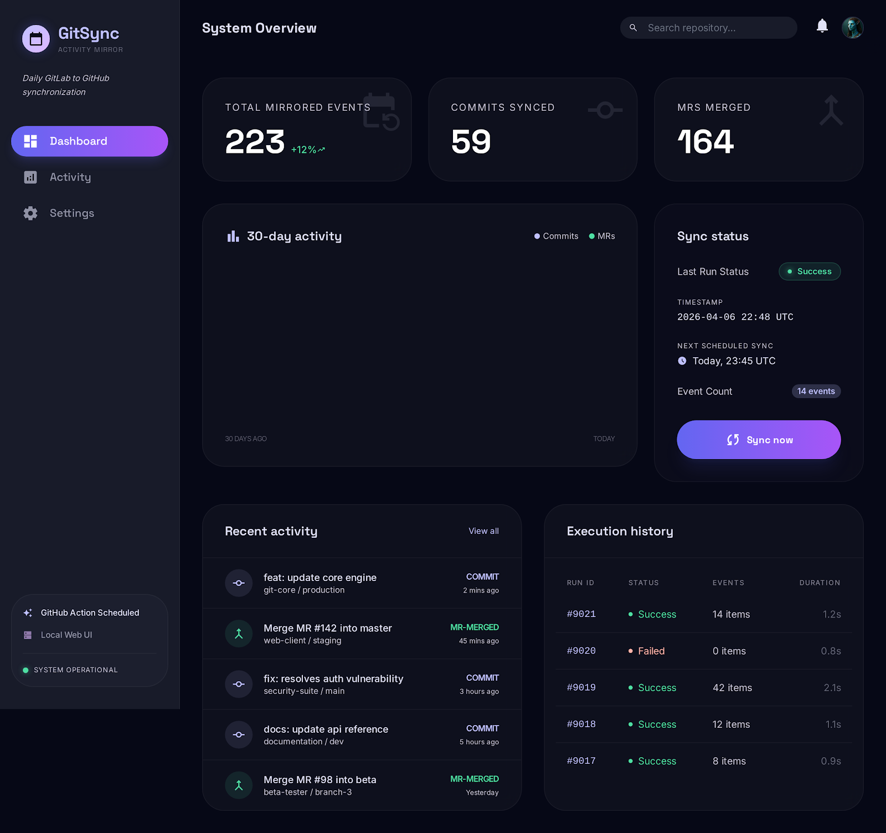
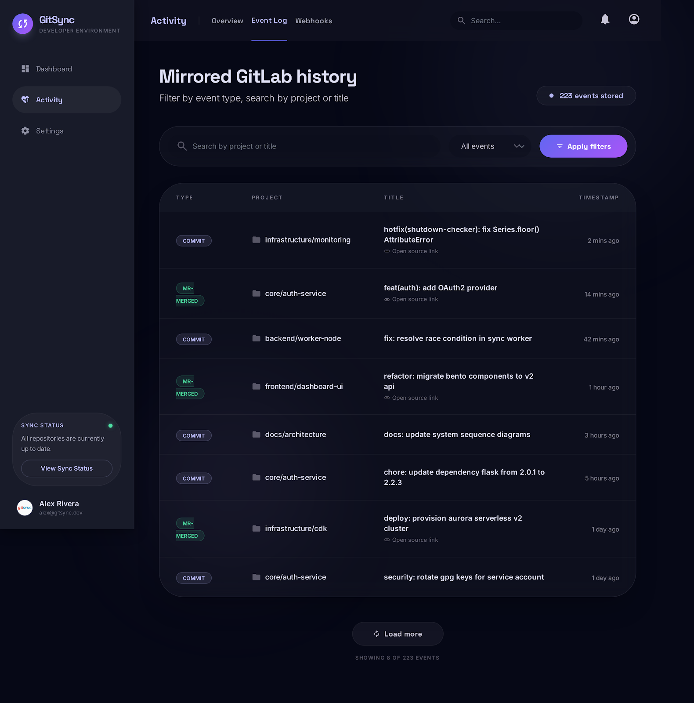
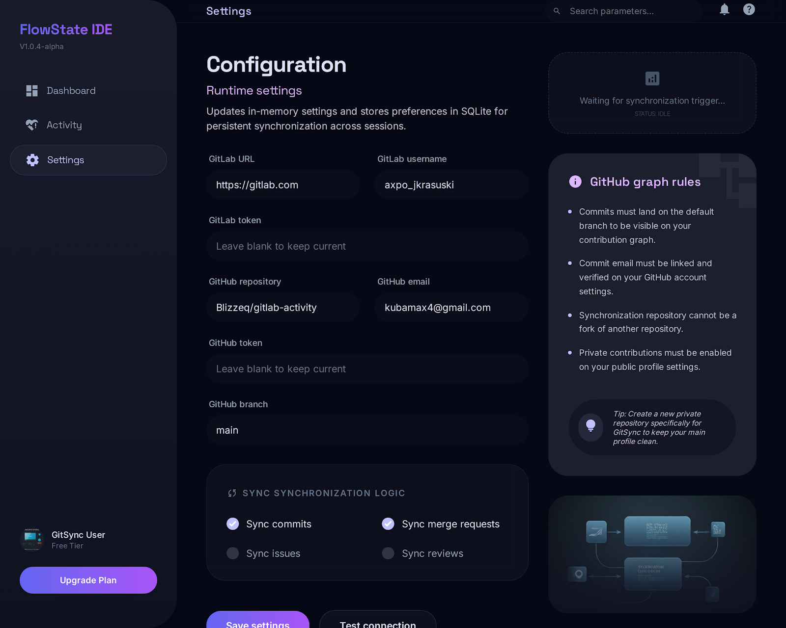

# GitSync

**Your GitLab work deserves to be seen.**

If you spend your days coding on GitLab but your GitHub profile looks like a ghost town, GitSync is for you. It mirrors your real GitLab activity (commits and merged MRs) into a private GitHub repo, so your contribution graph actually reflects the work you do every day.

No code is copied. Just commit messages and timestamps, synced automatically via a GitHub Action.



## How it works

GitSync connects to the GitLab API, grabs your commits and merged merge requests, and creates matching empty commits in a GitHub repository you own. Each commit keeps the original message and timestamp, so your contribution graph fills up with green squares that map to your actual work.

The sync runs daily as a GitHub Action. You can also run it manually from the CLI or the built-in web dashboard.

**What gets synced:**

| Source | Shows up as | Example |
|--------|------------|---------|
| Your commits (excluding auto-generated merge commits) | `[commit]` | `[commit] my-org/backend: fix timezone handling` |
| Your merged merge requests | `[mr-merged]` | `[mr-merged] my-org/backend!145: add OAuth2 provider` |

Noise like `Merge branch 'x' into 'main'` and generic push events is filtered out automatically.

## Screenshots

**Activity log** with filtering and search:



**Settings** page with connection testing:



## Getting started

The whole setup takes about 10 minutes. You'll need Python 3.11+, a GitLab account and a GitHub account.

### 1. Create a private GitHub repository

Head over to [github.com/new](https://github.com/new) and create a new **private** repository. Call it something like `gitlab-activity`. Make sure to check "Add a README file" so the repo isn't empty.

This is where your mirrored commits will live. Since it's private, nobody can see the commit details, but the green squares still show up on your profile.

### 2. Get your access tokens

You'll need two tokens: one for reading from GitLab, one for writing to GitHub.

**For GitLab:** go to your profile, then Access Tokens, and create a new one. Give it a name like `gitsync`, set an expiration date, and select the `read_api` scope. That's the only permission it needs.

**For GitHub:** go to Settings, then Developer settings, then Fine-grained personal access tokens. Create one scoped to just your `gitlab-activity` repository with "Contents: Read and write" permission.

### 3. Install GitSync

```bash
git clone https://github.com/Blizzeq/gitsync.git
cd gitsync
python -m venv .venv
source .venv/bin/activate
pip install -e .
```

Then run the interactive setup wizard:

```bash
gitsync init
```

It will ask you for your GitLab URL, username, tokens, GitHub repo name, email, and branch. Everything gets saved to a local `.env` file.

One important thing: the **GitHub email** you provide must match the email linked to your GitHub account. Otherwise the contribution graph won't count your commits.

### 4. Run your first sync

```bash
gitsync sync
```

This pulls your GitLab activity and pushes matching commits to GitHub. The first run might take a minute depending on how much history you have. After that, daily syncs are nearly instant because GitSync remembers what it already synced.

### 5. Set up the daily GitHub Action

This is the part that makes it fully automatic. You need to add three secrets to your `gitlab-activity` repository on GitHub.

Go to your repo's Settings, then Secrets and variables, then Actions, and add these:

| Secret name | What to put there |
|-------------|-------------------|
| `GITLAB_TOKEN` | The GitLab token you created in step 2 |
| `GITLAB_USERNAME` | Your GitLab username |
| `GIT_EMAIL` | The email linked to your GitHub account |

You don't need to add a GitHub token. GitHub Actions automatically provides one.

Next, create a file at `.github/workflows/sync.yml` in your `gitlab-activity` repo with this content:

```yaml
name: GitSync - Daily Activity Sync

on:
  schedule:
    - cron: '17 6 * * *'
  workflow_dispatch:

permissions:
  contents: write

env:
  FORCE_JAVASCRIPT_ACTIONS_TO_NODE24: true

jobs:
  sync:
    runs-on: ubuntu-latest
    steps:
      - uses: actions/checkout@v4
        with:
          fetch-depth: 0

      - uses: actions/setup-python@v5
        with:
          python-version: '3.11'

      - name: Install GitSync
        run: pip install git+https://github.com/Blizzeq/gitsync.git

      - name: Run sync
        env:
          GITSYNC_GITLAB_TOKEN: ${{ secrets.GITLAB_TOKEN }}
          GITSYNC_GITLAB_USERNAME: ${{ secrets.GITLAB_USERNAME }}
          GITSYNC_GITLAB_URL: https://gitlab.com
          GITSYNC_GITHUB_TOKEN: ${{ secrets.GITHUB_TOKEN }}
          GITSYNC_GITHUB_REPO: ${{ github.repository }}
          GITSYNC_GITHUB_EMAIL: ${{ secrets.GIT_EMAIL }}
        run: python -m gitsync sync
```

The `cron: '17 6 * * *'` part means it runs daily at 06:17 UTC. Feel free to adjust that to whatever time works for you.

You can also trigger it manually anytime from the Actions tab in your repo.

### 6. Turn on private contributions

Last step. Go to your GitHub profile, click on your contribution graph, and make sure **"Include private contributions on my profile"** is checked. Without this, commits to private repos won't show up as green squares.

## Web dashboard

GitSync comes with a local web UI that you can use to monitor syncs, browse your activity history, and trigger manual syncs with one click.

```bash
gitsync serve
```

Then open `http://127.0.0.1:8765` in your browser. You'll find three pages:

**Dashboard** shows your stats at a glance: total events, a 90-day activity chart, sync status, and a big "Sync now" button for when you don't want to wait for the next scheduled run.

**Activity** is a full searchable log of everything that's been mirrored. You can filter by event type (commits vs merged MRs) and search by project name or commit title.

**Settings** lets you update your configuration, toggle what gets synced, and test your GitLab connection without touching config files.

## CLI reference

| Command | What it does |
|---------|-------------|
| `gitsync sync` | Runs one synchronization cycle |
| `gitsync serve` | Starts the web dashboard on localhost |
| `gitsync status` | Prints the most recent sync result |
| `gitsync init` | Walks you through creating a `.env` config file |

## How deduplication works

GitSync will never create duplicate commits, even if you run it multiple times or from different machines. Before creating any commit, it checks two things:

1. The local SQLite database that tracks every event it has already mirrored.
2. The actual git history of the target repo, matching by commit message.

The second check is what makes GitHub Actions work smoothly. Each Action run starts with a clean filesystem, so there's no local database to consult. Instead, GitSync clones the target repo, reads the existing commit messages, and skips anything that's already there.

## Configuration

All settings come from environment variables prefixed with `GITSYNC_`, or from a `.env` file in your project directory. The `gitsync init` command creates this file for you.

| Variable | Required | Default | What it does |
|----------|----------|---------|--------------|
| `GITSYNC_GITLAB_TOKEN` | yes | | GitLab personal access token with `read_api` scope |
| `GITSYNC_GITLAB_USERNAME` | yes | | Your GitLab username |
| `GITSYNC_GITHUB_REPO` | yes | | Target repository in `owner/name` format |
| `GITSYNC_GITHUB_TOKEN` | yes | | GitHub token with contents write permission |
| `GITSYNC_GITHUB_EMAIL` | yes | | Email linked to your GitHub account |
| `GITSYNC_GITLAB_URL` | no | `https://gitlab.com` | Your GitLab instance URL |
| `GITSYNC_GITHUB_BRANCH` | no | `main` | Branch to push commits to |
| `GITSYNC_DB_PATH` | no | `~/.gitsync/gitsync.db` | Where to store the local sync database |
| `GITSYNC_SYNC_COMMITS` | no | `true` | Whether to sync commit events |
| `GITSYNC_SYNC_MERGE_REQUESTS` | no | `true` | Whether to sync merged MR events |
| `GITSYNC_APP_HOST` | no | `127.0.0.1` | Web dashboard host |
| `GITSYNC_APP_PORT` | no | `8765` | Web dashboard port |

## Contribution graph requirements

There are a few things GitHub requires for commits to count toward your green squares:

1. The repository must belong to you and cannot be a fork.
2. Commits must land on the default branch (usually `main`).
3. The email in the commit must be linked to your GitHub account.
4. You need to enable "Include private contributions" on your profile.

GitSync handles points 1 through 3 automatically. You just need to do point 4 once in your GitHub settings.

## Tech stack

Built with Python 3.11+ using httpx for async API calls, aiosqlite for local persistence, FastAPI with Jinja2 and HTMX for the web dashboard, Tailwind CSS for styling, and Typer for the CLI. The whole thing runs without any JavaScript framework or Node.js build step.

## Development

```bash
pip install -e .[dev]
make check    # runs black, ruff, mypy, and pytest in sequence
```

## License

MIT
